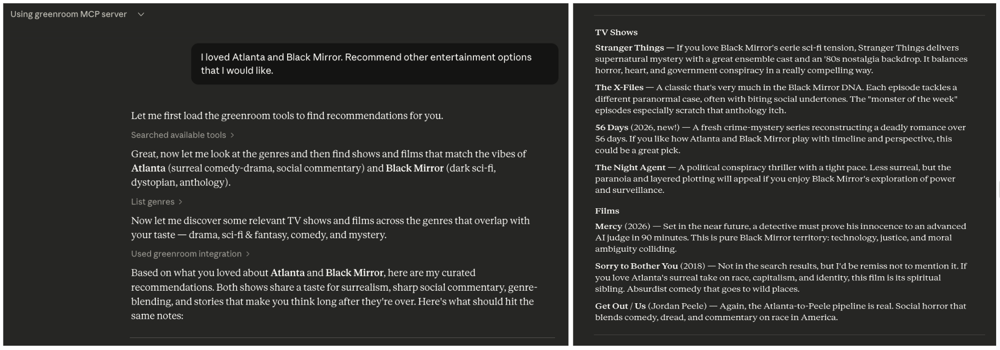
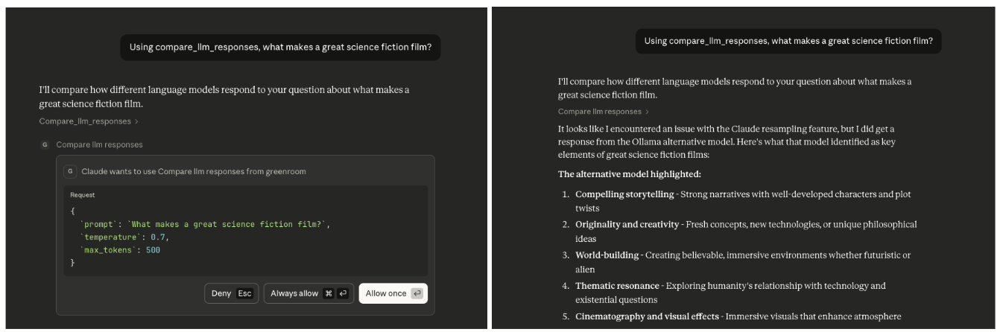

# greenroom

A python package containing an MCP server that coordinates outreach to multiple LLMs, 
integrates with external content providers, and provides custom tooling to agents with the goal
of producing high-value, hybrid human-AI curation of entertainment recommendations.

As of 2026, greenroom provides recommendations on film and television content. I plan
to integrate with additional data providers and LLM services to broaden the offering.

#### Discover films and television using hybrid human-AI curation  


#### Compare outputs of multiple agents and models


## Use Cases
The greenroom MCP server can be used to answer a wide range of questions related to entertainment. 
Below are some example prompts that will trigger the use of multiple MCP tools, but these are just examples.

### Recommendations
- `What kinds of entertainment can you recommend?`
- `I'm in the mood for something serious. Recommend some entertainment content.`
- `Recommend spanish language documentary films from the 2010s.`
- `I loved Atlanta and Black Mirror. Recommend other entertainment options that I would like.`

### Event Planning
- `I'm hosting a French film night. Recommend highly-rated French films across genres.`
- `Plan a binge-watching weekend including recent dramas and comedies.`
- `Let's host a sci-fi movie marathon. Recommend 5 sci-fi films from different decades.`

### Industry Analysis
- `Analyze which genres have the highest average ratings in film vs television.`
- `Compare action films made in the 1980s to those made in the 2020s.`
- `What are the top-rated spanish language television shows in each genre?`

### Compare the output of multiple agents
- `Using compare_llm_responses, what makes a great science fiction film?`
- `Using the compare_llm_responses tool, how is machine learning used in modern filmmaking?`

## Features

### Tools

| Category | Tool | Description |
| --- | --- | --- |
| Genres | **list_genres** | Fetches all entertainment genres, returning a unified map showing which media types support each genre |
| Genres | **categorize_genres** | Maps human moods to media genres to improve hit rate from human prompts |
| Films | **discover_films** | Retrieves list of films based on selected criteria. Returns metadata for informed responses and optimized categorization. |
| Films | **search_films** | Looks up films by title. Search can be optionally narrowed by release year. Returns the same metadata shape as discover_films. |
| Television | **discover_television** | Retrieves list of television shows based on selected criteria. Returns metadata for informed responses and optimized categorization. |
| Television | **search_television** | Looks up television shows by title. Search can be optionally narrowed by release year (year of first airing). Returns the same metadata shape as discover_television. |

_MCP tools are callable actions, analogous to POST requests, that an agent executes. They are annotated with `@mcp.tool()` in the FastMCP framework._

### Coordination of Agents
This server supports the coordination of multiple agents to work on a single task. 

- **compare_llm_responses** - Receives a prompt and fields it out to two agents. It constrains the responses by temperature and token limit.

> To trigger this tool, ask the agent: Using the compare_llm_responses tool, why is the ocean blue?
>
> You should see: 
>   Both a resampled response and an ollama response 
>   Response lengths comparison
>   Structured JSON output showing both LLM outputs side-by-side

_As of 2026, this defaults to comparing the response from a resampling of the current client to a response from a new ollama client. 
If you use the server with Claude, the resampled response will be null because Anthropic forbids resampling._

### Contexts
Context-aware tools use FastMCP's `Context` parameter to access advanced MCP features like LLM sampling.

Example:
- **list_genres_simplified** - Returns a simplified list of genre names by using `ctx.sample()` to leverage the agent's LLM capabilities for data transformation.

### Resources
These resources provide read-only data, analogous to GET requests. An agent reads the information but does not perform actions. 
Resources are annotated with `@mcp.resource()` in the FastMCP framework.
- **config://version** - Get server version

### Error Handling
All errors raised by the greenroom server use a custom exception hierarchy rooted in `GreenroomError`. 
This means MCP callers can catch `GreenroomError` to handle any server-side failure, or catch a specific subclass for finer control:

- **APIResponseError** - HTTP errors, invalid JSON, unexpected response bodies from external APIs
- **APIConnectionError** - Network or connectivity failures when reaching external APIs
- **APITypeError** - Response had an unexpected python type after deserialization
- **SamplingError** - Errors during LLM sampling

Built-in exceptions like `ValueError` are still raised for input validation (e.g., invalid parameters).

## Architecture

```
Tools Layer (MCP Interface)
    ↓
Services Layer (Business Logic)
    ↓
Client Layer (Provider-specific HTTP Communication)
    ↓
Models Layer (Provider-agnostic Data Structures)
```

### Project Structure
This project follows the python package src/ layout to support convenient packaging and testing.
Below is a simplified diagram of the project.

```
greenroom/
├── src/
│   └── greenroom/                       # python package
│       │
│       ├── server.py                    # primary entry point to server
│       ├── config.py                    # centralized configuration
│       ├── utils.py                     # shared utilities
│       │
│       │
│       ├── models/                      # data models     
│       │
│       ├── services/                    # business logic 
│       │   ├── llm/                     # LLM agent services and clients
│       │   ├── tmdb/                    # TMDB provider services and clients
│       │   └── protocols.py             # standardizes methods across media providers
│       │
│       └── tools/                       # MCP tools (exposed via FastMCP)
│            ├── agent_tools.py          # coordinate multiple agents and LLMs
│            ├── genre_tools.py          # optimize genre discovery and presentation to user
│            └── discovery/              # tools for retrieving entertainment content
│
├── tests/greenroom/                     # test suite
│
├── pyproject.toml                       # configuration and dependencies
└── uv.lock                              # dependency lock file (auto-generated)
```

### Dependencies

- **python >=3.10**
- **FastMCP >=2.13.0**; MCP server framework; requires python 3.10+
- **uv**: package manager
- **Hatchling**: build system
- **httpx**: network calls to external data sources
- **python-dotenv**: API key management
- **ollama** (optional): local LLM runtime for multi-agent tools like `compare_llm_responses`

_I chose **FastMCP** framework for this project, because it requires minimal boilerplate.
In previous projects, I used alternative frameworks like MCP Python SDK to understand more fundamental mechanics._

## Setup

1. Create local development environment
```
# Clone the repository
git clone <repository-url>
cd greenroom

# Install dependencies (uv will create a virtual environment automatically)
uv sync
```

2. Add TMDB api key as environment variable
- Get a free API key at [TMDB](https://www.themoviedb.org) by creating an account, going to account settings, and navigating to the API section.
- Create a file called `.env` at the top level of the project. (This file is gitignored to prevent committing secrets.)
- Copy the content of `.env.example` to your new file.
- Replace `your_tmdb_api_key_here` in .env with the actual TMDB API key.

### (optional) Setup ollama
To use ollama as a second agent (in addition to Claude). An example of usage is the **compare_llm_responses** tool.

1. **Install ollama**
Download from https://ollama.com/download.

2. **Start ollama service**
Open ollama desktop application or start from terminal:
```
ollama serve
```

3. **Pull the default model**
The `compare_llm_responses` tool defaults to llama3.2:latest as of 2026.
```
ollama pull llama3.2
```

Verify the model is available.
```
ollama list
```

4. **Test ollama is working**
```
curl http://localhost:11434/api/generate -d '{"model": "llama3.2", "prompt": "Why is the sky blue?", "stream": false}'
```

Expected response will look something like the below.
```
 {
   "model":"llama3.2",
   "created_at":"2025-11-30T12:01:32.314915Z",
   "response":"The sky appears blue because of a phenomenon called Rayleigh scattering...
   ...
 }
```

## Usage

Regardless of your preferred platform, exercising the server is fairly standardized.
- `/mcp` will display the server with access to the list of tools and their descriptions.
- Tools will automatically be used during conversations.
- To explicitly test a tool, ask that agent to call the tool. e.g. `Call the <name-of-tool> tool from the greenroom MCP server to answer the following:...`
- If you update any tools, you must `/reload` a session for the updates to become available.

### via vibe CLI

1. Add the server configuration to a local toml file
   - Create `.vibe/` directory at the top-level of the project. Create `config.toml` file within that directory. 
   - Add the below to `config.toml`.
    ```toml
    [[mcp_servers]]
    name = "greenroom"
    transport = "stdio"
    command = "uv"
    args = [
      "--directory",
      "/ABSOLUTE/PATH/TO/PROJECT",
      "run",
      "python",
      "src/greenroom/server.py"
    ]
    startup_timeout_sec = 15.0
    ```
2. Exercise in vibe CLI
   - `vibe` to open a fresh session
   - Type `/mcp` to view available MCP servers. 
   - Confirm that greenroom is one of them with status: connected.

### via claude CLI

1. Update local claude settings and start the server
  ```
  claude mcp add greenroom --scope project -- uv --directory /ABSOLUTE/PATH/TO/PROJECT run python src/greenroom/server.py
  ```

2. Exercise in claude CLI
   - `claude` to open a fresh session
   - Type `/mcp` to view available MCP servers. 
   - Confirm that greenroom is one of them with status: connected.

### via claude desktop app

1. Open the claude desktop app.

2. Confirm the desktop app is connected to the greenroom server:
   - Navigate to Settings.
   - Click on "Developer". Local MCP Servers should appear.
   - The greenroom server should be listed there and it should have status: running.
   - If it is not running, click on 'Edit Config'. Then follow the instructions in the Troubleshooting section below.

## Development

**Run the MCP server locally**

The server will start and communicate via stdin/stdout. It uses stdio by default, which is the standard transport for local MCP servers.

```
uv run greenroom                        # recommended: uses the MCP entry point

uv run python src/greenroom/server.py   # alternative
```

_NB: You should not run the server directly (e.g. `uv run <path to server.py>`) because the server is part of a python package.
Running it directly would break the module resolution._

**Inspect using MCP Inspector (web ui)**

```
npx @modelcontextprotocol/inspector uv --directory /ABSOLUTE/PATH/TO/PROJECT run python src/greenroom/server.py
```

**Run tests**

The test suite includes a kickoff of the mypy type checker.
```
uv run pytest               # fast unit and integration tests; excludes external tests that make real network calls

uv run pytest -m external   # tests that make real network calls to confirm contracts
```

_Design Note: The `@mcp.tool()` decorator wraps functions into a FunctionTool objects, which prevents the decorated function from being callable as a plain function.
To ease testability and provide modular interfaces, I delegated the logic within each tool to high-level public orchestration methods, which can be tested without spinning up a server and which use shared utility modules.
The remaining top-level registration layer of each tool is covered separately by registration tests, which build an in-memory FastMCP server to verify the tool names, parameter schemas, and the arguments each tool forwards to its delegate._

## Troubleshooting

### claude CLI troubleshooting

**Confirm correctness of the local claude configuration.**

  When you run the setup command (`claude mcp add ... --scope project`), a configuration for that MCP server is added to a `.mcp.json` file at the project root.
  _This is a different than the configuration file that the claude desktop app uses._

  - Align your local `.mcp.json` with the below.
  - Replace `/ABSOLUTE/PATH/TO/PROJECT` with the actual path to the project directory (not the package directory) on your local machine.
  - Replace `/ABSOLUTE/PATH/TO/UV/LIBRARY` with the actual path to uv on your local machine. On mac, `which uv` should print out this directory.

  ```json
  {
    "mcpServers": {
      "greenroom": {
        "command": "/ABSOLUTE/PATH/TO/UV/LIBRARY",
        "args": [
          "--directory",
          "/ABSOLUTE/PATH/TO/PROJECT",
          "run",
          "python",
          "src/greenroom/server.py"
        ]
      }
    }
  }
  ```

**When experiencing configuration issues**, sometimes it helps to remove the mcp server from your local machine and add it back again.

1. Remove the local configuration.
```
claude mcp remove greenroom
```

2. Update the local configuration and run the MCP server.
```
claude mcp add greenroom --scope project -- uv --directory /ABSOLUTE/PATH/TO/PROJECT run python src/greenroom/server.py
```

### claude desktop app troubleshooting

**Confirm correctness of local claude desktop configuration**

  Clicking "Edit Config" in the Developer settings (see the Usage section above) opens `claude_desktop_config.json` in your default text editor. 
  _This is a different configuration file than the CLI uses and it applies globally across every project opened in the desktop app rather than to a single project._

  - On Mac, this file generally lives at `~/Library/Application Support/Claude/claude_desktop_config.json`.
  - Replace `/ABSOLUTE/PATH/TO/PROJECT` with the actual path to the project directory (not the package directory) on your local machine.
  - Replace `/ABSOLUTE/PATH/TO/UV/LIBRARY` with the actual path to uv on your local machine. On mac, `which uv` should print out this directory.

  ```json
  {
    "mcpServers": {
      "greenroom": {
        "command": "/ABSOLUTE/PATH/TO/UV/LIBRARY",
        "args": [
          "--directory",
          "/ABSOLUTE/PATH/TO/PROJECT",
          "run",
          "python",
          "src/greenroom/server.py"
        ]
      }
    }
  }
  ```

**When experiencing configuration issues**, sometimes it helps to remove the mcp server entry and add it back again.

1. Remove the `greenroom` entry from `claude_desktop_config.json` and save the file.
2. Re-add the `greenroom` entry (matching the JSON above) and save the file.
3. Fully quit and reopen the claude desktop app for the change to take effect.


### Underlying Mechanics

1. The `pyproject.toml` file declares the `fastmcp` dependency managed by uv
2. When an agent starts, it launches this MCP server as a subprocess using the configured command
3. `uv` automatically manages the virtual environment and dependencies
4. The server advertises its available resources and tools (e.g. the `tools/list` JSON-RPC method)
5. During conversations, the agent can automatically call these tools when relevant
6. The server executes the requested tool and returns results to the agent
7. The agent incorporates the results into its response to you

## Future Development
- Add more media types (e.g., podcasts, books)
- Add providers to augment data sources
- Add an entertainment concierge experience (e.g., manager agent flow)